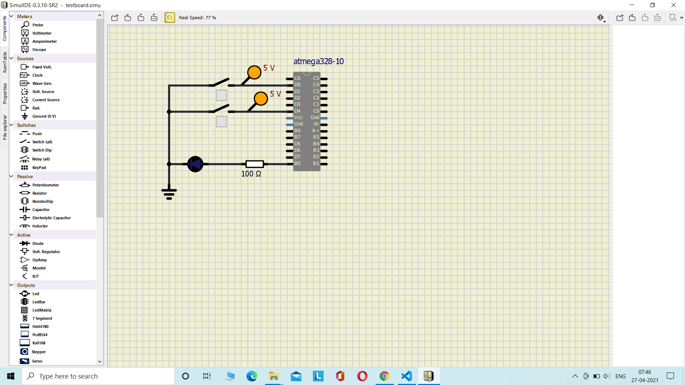
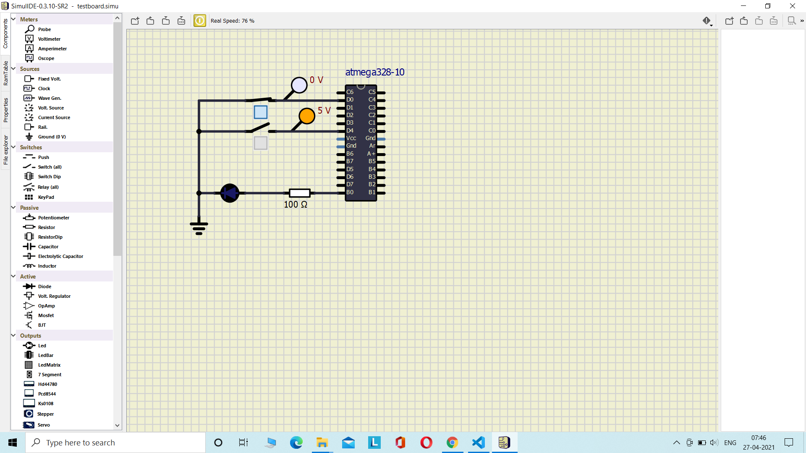
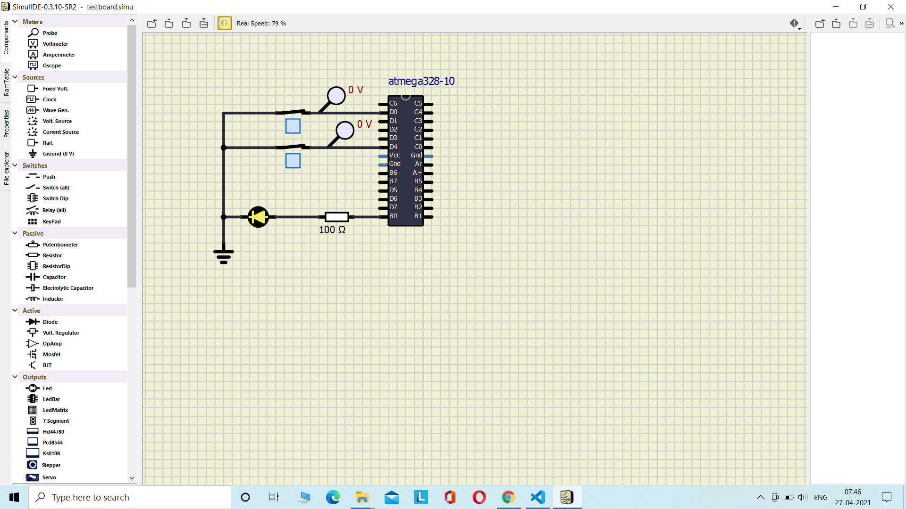

# LTTS stepin Mini Project-2
# Embedded C Programming Activities with Continuous Integration and Code Quality

# Activity 1 
   ## If car seat is occupied and heater is ON indicate by turning on a LED using AVR programming

##### CI and Code Quality

### In Action

#### 1. Car seat vacant and heater switch is off: LED is OFF

#### 2. Car seat is occupied and heater switch is off: LED is OFF

#### 3. Car seat is vacant and heater switch is on: LED is OFF

#### 4. Car seat is occupied and heater switch is on: LED is turned ON

